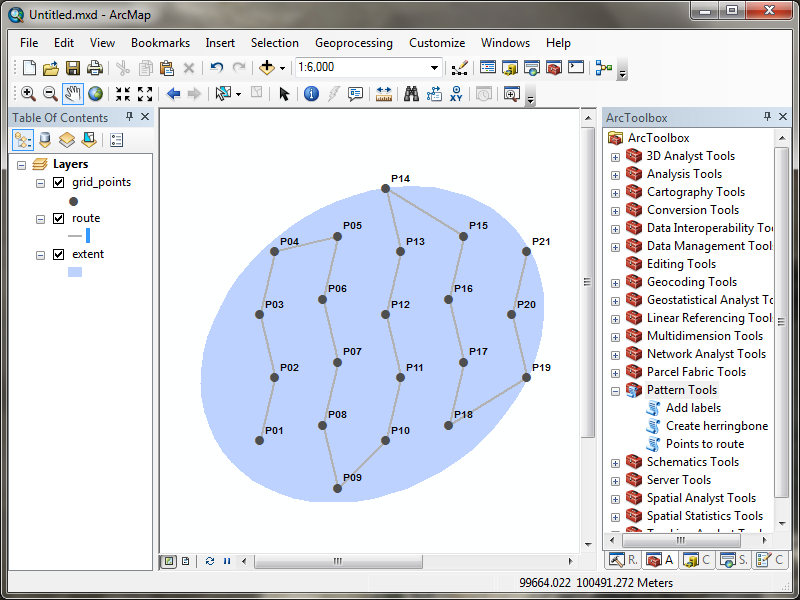

# Patterns toolbox

ArcGIS toolbox to create patterns.

Included tools:

 - Add labels
 - Create herringbone
 - Points to route

The toolbox has been tested using ArcGIS 10.2 and 10.3.

## Installation

Downloads and instructions on the [release page](https://github.com/EnviroCentre/patterns-toolbox/releases/latest).
